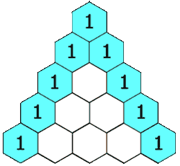

# 118. Pascal's Triangle

**Difficulty:** Easy

## Problem Description

Given an integer `numRows`, return the first `numRows` of **Pascal's triangle**.

In Pascal's triangle, each number is the sum of the two numbers directly above it as shown:



---

## Examples

**Example 1**  
```
Input: numRows = 5
Output: [[1],[1,1],[1,2,1],[1,3,3,1],[1,4,6,4,1]]
```

**Example 2**  
```
Input: numRows = 1
Output: [[1]]
```

---

## Constraints

- `1 <= numRows <= 30`

---

## Solution Approach

We can build Pascal's Triangle iteratively:

1. Start with the first row `[1]`.
2. Each subsequent row starts and ends with `1`.
3. Every inner element is the sum of the two elements above it from the previous row.

**Pseudocode (Go-style):**
```go
func generate(numRows int) [][]int {
    triangle := make([][]int, numRows)
    for i := 0; i < numRows; i++ {
        row := make([]int, i+1)
        row[0], row[i] = 1, 1
        for j := 1; j < i; j++ {
            row[j] = triangle[i-1][j-1] + triangle[i-1][j]
        }
        triangle[i] = row
    }
    return triangle
}
```

---

## Complexity Analysis

- **Time Complexity:** O(numRows²) — We fill each cell of the triangle once.
- **Space Complexity:** O(numRows²) — Space for storing the entire triangle.

---
